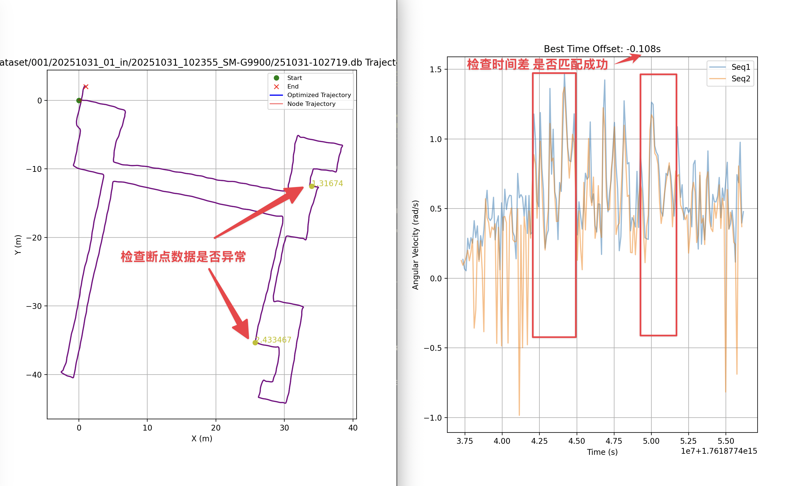

# 使用说明

## 数据检查说明

数据检查功能用于验证数据集的质量和时间同步性，主要包括时间偏移量检测和Ground Truth数据间隔分析。

### 功能特性

1. **时间偏移量检测**：通过相关性匹配算法计算IMU数据和Ground Truth数据之间的最佳时间偏移量
2. **Ground Truth间隔分析**：检查Ground Truth数据的时间间隔，识别异常大的时间间隔
3. **可视化展示**：生成图表直观显示数据质量

### 使用方法

#### 检查单个数据集

```bash
python DataCheck.py -u dataset/001/20251031_01_in/20251031_101025_SM-G9900
```

#### 检查整个数据组

```bash
python DataCheck.py -g dataset/001/20251031_01_in
```

### 检查内容

#### 1. 时间偏移量检测

- 使用相关性匹配算法计算IMU和Ground Truth数据的时间偏移
- 输出最佳时间偏移量（秒）
- 生成相关性匹配图表

#### 2. Ground Truth数据间隔分析

- 计算数据频率（Hz）
- 分析时间间隔的统计信息（最大值、平均值）
- 识别超过阈值（默认1秒）的异常时间间隔
- 在异常位置进行标记并生成可视化图表

### 输出示例

```
频率: 30.15 Hz
时间间隔 最大/平均: 1.234 s / 0.033 s
最佳时间偏移量 = 0.125 秒
```

### 可视化结果

数据检查会生成可视化图表，帮助直观了解数据质量：



图表中会标记出异常的时间间隔位置，便于进一步分析和处理。

### 参数说明

- `-u, --unit`: 指定要检查的单个数据集路径
- `-g, --group`: 指定要检查的数据组路径（会检查该组下所有数据集）
- `-d, --dataset`: 指定整个数据集的路径
- `max_gap_s`: Ground Truth数据最大允许时间间隔（默认2秒）
